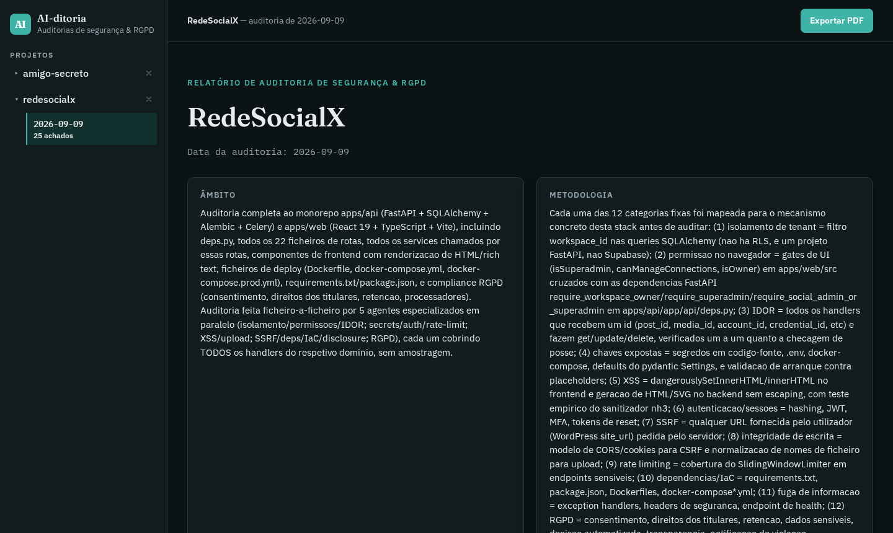
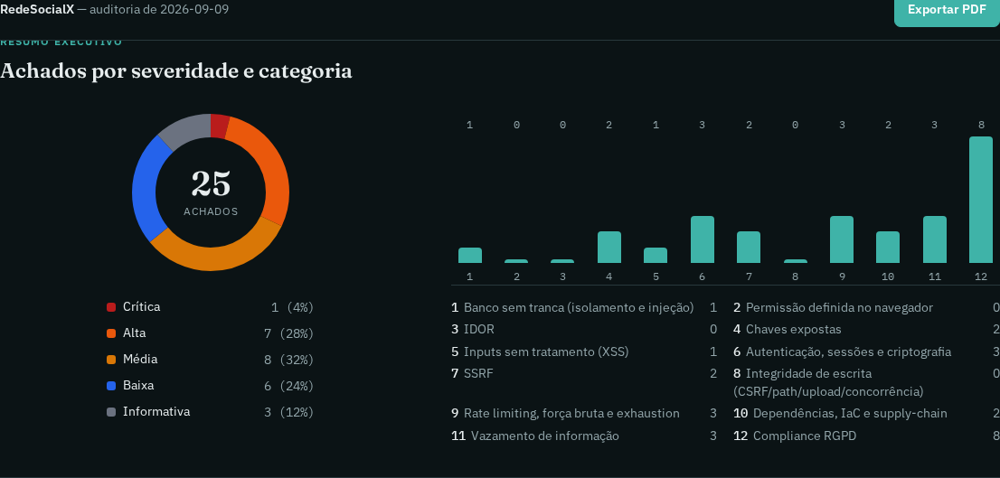
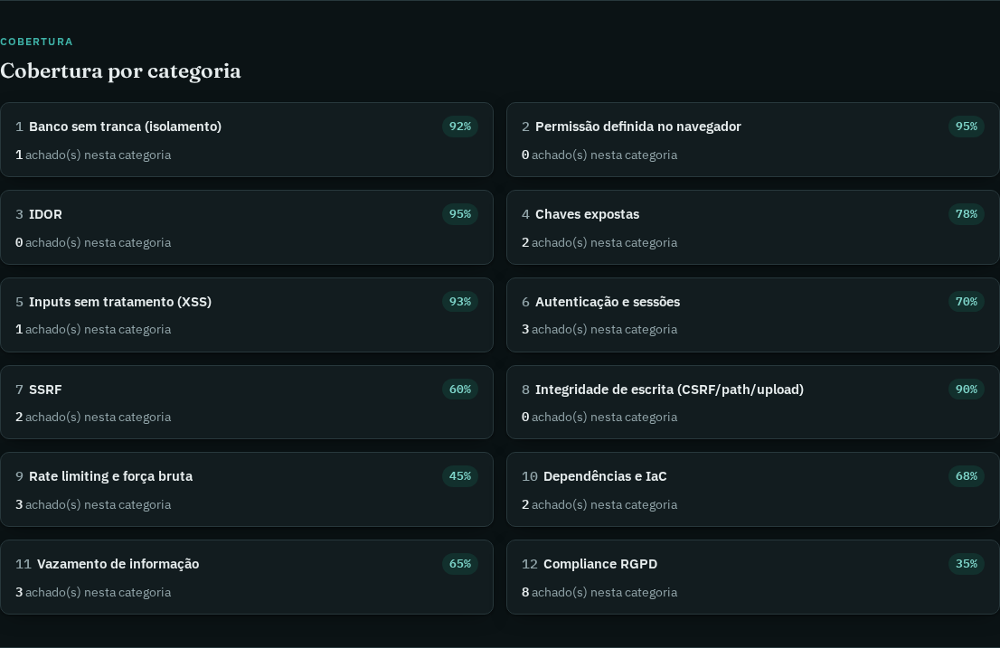
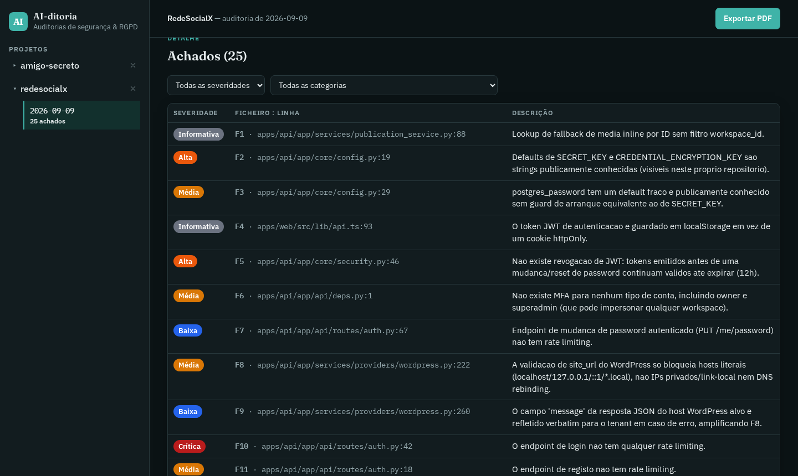
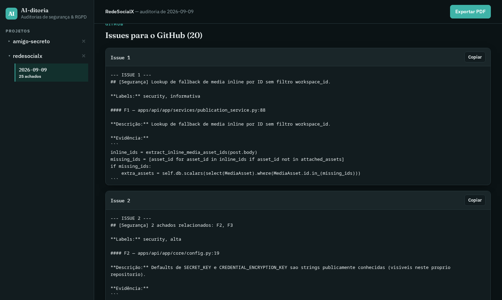
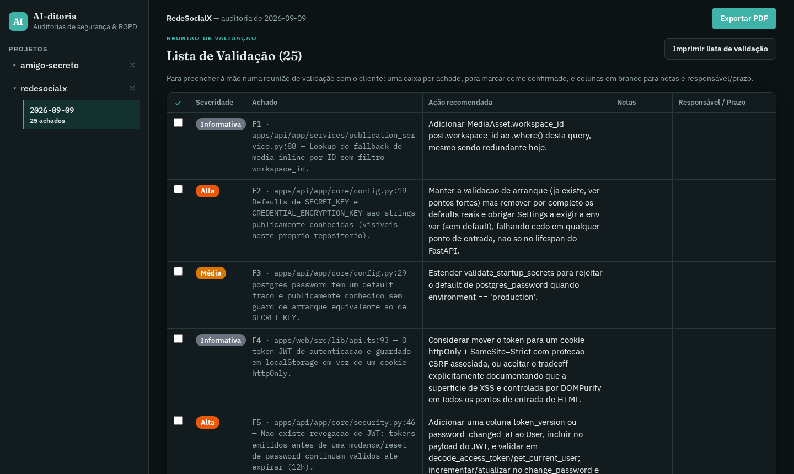
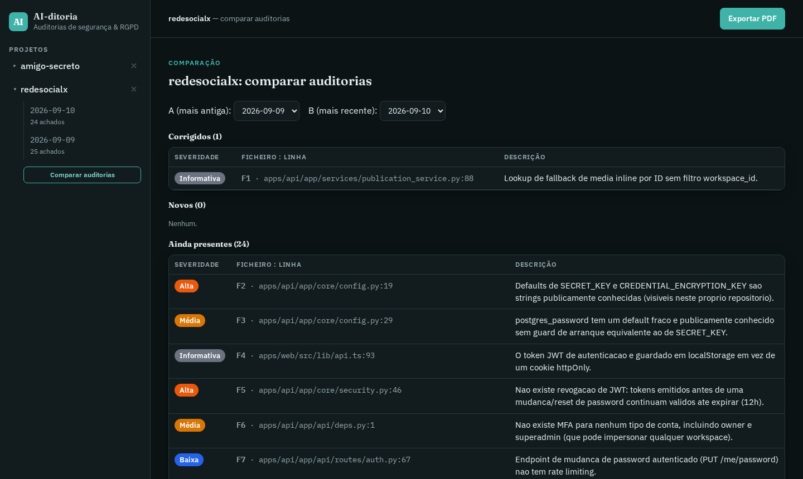

# AI-ditoria - (AI-dict)

[](LICENSE)
[](https://lucianomilani.github.io/AI-ditoria/security-audit/studio/)
[](#como-correr-os-testes)

🇵🇹 [Português](#português) · 🇬🇧 [English](#english)

---

## Português

Repositório do **Audit Report Studio** — a base onde ficam guardados e
publicados os relatórios de auditoria de segurança + RGPD gerados pelo
skill `/security-audit`.

Não é uma app com backend, não tem `npm install` gigante, não tem
segredos escondidos. É JSON, HTML puro e um dashboard estático servido
pelo GitHub Pages. Simples de propósito.

### Objetivo e foco principal

O foco deste projeto **não é o dashboard** — é a **skill** `/security-audit`
em si: uma metodologia de auditoria de segurança + RGPD, stack-agnostic,
repetível e consistente entre projetos diferentes. O dashboard existe só
para dar um sítio central e comparável a esse trabalho (histórico por
projeto, comparar auditorias, gerar issues) — sem ele, a skill continua a
auditar código na mesma.

A skill é feita de **ficheiros simples e portáteis**: um `SKILL.md`
(instruções em markdown), docs de referência em `reference/*.md`, e um
único script Node sem dependências (`validate-findings.mjs`) que valida e
mascara segredos antes de publicar. Nada disto depende de APIs
proprietárias — é o formato de "skill" que o Claude Code usa
(`~/.claude/skills/<nome>/`), mas a lógica em si funciona em qualquer
agente de coding com um conceito equivalente de skill/prompt reutilizável
(ex.: OpenCode, ou outro agente que suporte pastas de skills). Adaptar
para outro agente é essencialmente copiar a pasta e apontar o trigger —
não é preciso reescrever a metodologia.

### Quickstart

```bash
# 1. num projeto qualquer (React, PHP, o que for), corre o skill
/security-audit

# 2. commit + push acontece automaticamente no passo 4 do skill

# 3. abre o dashboard
open https://lucianomilani.github.io/AI-ditoria/security-audit/studio/
```

### O fluxo: analisar e gerar relatórios bem estruturados

1. Corres `/security-audit` (ou `/security-audit <caminho>`) num
   projeto qualquer — pode ser React, PHP, o que for.
2. O skill detecta a stack desse projeto, audita-o linha a linha contra
   **12 categorias fixas**: isolamento multi-tenant e SQL/NoSQL injection,
   permissões só no frontend, IDOR, chaves expostas, XSS, auth/sessões e
   uso indevido de criptografia, SSRF, CSRF/path/upload e race
   conditions/lógica de negócio, rate limiting e exhaustion de recursos,
   dependências/IaC e supply-chain, fuga de informação, e compliance RGPD.
3. Gera um `findings.json` com tudo o que encontrou — achados, pontos fortes, painel RGPD, cobertura por categoria — e valida esse ficheiro com um script (`validate-findings.mjs`) antes de aceitar nada.
4. Escreve esse JSON aqui, dentro de
   `docs/security-audit/studio/data/<projeto>/<data>.json`, atualiza o índice (`data/index.json`) e faz commit + push.
5. O GitHub Pages serve a pasta `docs/` como site, e o dashboard fica disponível em:

   **https://lucianomilani.github.io/AI-ditoria/security-audit/studio/**

Ou seja: cada auditoria feita em qualquer PC, para qualquer projeto, acaba num único sítio central — sem servidor, sem base de dados, só ficheiros estáticos e git.

### O dashboard, em imagens

Visão geral — sidebar com os projetos auditados, capa da auditoria:



Sumário executivo — achados por severidade e categoria:



Cobertura por categoria — maturidade estimada em cada uma das 12 categorias:



Detalhe dos achados, filtrável por severidade e categoria:



Issues geradas prontas a colar no GitHub:



Lista de Validação imprimível, para a reunião com o cliente:



Comparar duas auditorias do mesmo projeto — corrigidos, novos, ainda presentes:



> Nota: estas capturas podem ficar desatualizadas em relação à UI live — o [dashboard](https://lucianomilani.github.io/AI-ditoria/security-audit/studio/) é sempre a fonte de verdade.

### Onde está cada coisa

```
docs/
  security-audit/
    studio/                  ← o dashboard em si (o "Audit Report Studio")
      index.html             ← toda a app (sem framework, JS puro)
      lib/                   ← lógica partilhada (validação, derivação, testes)
      data/                  ← os relatórios publicados (index.json + um JSON por auditoria)
    legacy/
      data.py                ← script antigo de amostra, anterior a este fluxo (não é o gerador atual)
      requirements.txt       ← dependências desse script antigo
  superpowers/
    plans/, specs/           ← desenho original desta ferramenta (v1 → v2)
```

A parte que efetivamente gera os relatórios — o skill `/security-audit`
— **não vive neste repo**. Fica em `~/.claude/skills/security-audit/`
(config local do Claude Code), porque precisa de correr sobre *qualquer*
outro projeto, não só este. O que este repo guarda é o resultado
publicado, não a ferramenta que o produz.

### O dashboard

`docs/security-audit/studio/index.html` é a app que lês no browser:
- Sidebar com a lista de projetos auditados (com botão para "esconder"
  um projeto localmente — não apaga os dados, só tira da vista nesse
  browser, porque é uma página estática sem permissão de escrita no
  disco).
- Um relatório completo por auditoria: capa, sumário executivo,
  cobertura por categoria, pontos fortes/fracos, painel RGPD,
  recomendações, e um gerador de issues para colar direto no GitHub.
- Uma **Lista de Validação** imprimível — uma tabela pensada para
  levares numa reunião com o cliente e ires marcando achado a achado à
  mão. A caixa "confirmado" fica guardada no browser (localStorage) —
  se reabrires o mesmo projeto/auditoria nesse browser, o que já
  marcaste continua marcado. Notas e Responsável/Prazo continuam só
  para imprimir e preencher à mão.
- **Comparar auditorias**: quando um projeto tem 2+ auditorias
  publicadas, aparece um botão na sidebar para escolheres duas datas e
  ver corrigidos / novos / ainda presentes entre elas — útil para
  confirmar que uma correção realmente aconteceu, ou apanhar
  regressões.

### Gate para CI

O `validate-findings.mjs` do skill (o que corre no passo 6 do processo
de auditoria) aceita um `--fail-on=<severidade>`:

```bash
node ~/.claude/skills/security-audit/scripts/validate-findings.mjs findings.json --fail-on=alta
```

Falha (exit 1) se existir algum achado nessa severidade ou acima
(`critica`, `alta`, `media`, `baixa`, `informativa` — critica é a mais
grave). Sem a flag, o comportamento é o mesmo de sempre: só valida a
forma do JSON. Isto corre no CI do projeto *auditado*, não deste repo
— o AI-ditoria em si não tem pipeline própria.

Exemplo de workflow GitHub Actions no projeto auditado:

```yaml
# .github/workflows/security-audit-gate.yml
name: Security audit gate
on: [pull_request]
jobs:
  gate:
    runs-on: ubuntu-latest
    steps:
      - uses: actions/checkout@v4
      - run: node ~/.claude/skills/security-audit/scripts/validate-findings.mjs findings.json --fail-on=alta
```

### Redação automática de segredos

O dashboard é público (GitHub Pages, sem autenticação) — logo o
`validate-findings.mjs` também mascara automaticamente qualquer chave de
API, password real ou email encontrado no texto de um achado, antes de
gravar o ficheiro:

```
REDACTED 2 secret(s)/email(s) before publishing (dashboard is public):
  findings[2].code [aws-access-key]
  findings[5].code [email]
```

O valor real é substituído por `***REDACTED***` diretamente no
`findings.json`; a categoria, severidade, ficheiro:linha e o resto da
explicação do achado continuam publicados normalmente — só o valor
sensível some. Defaults de exemplo/placeholder (`"change-this-*"`,
`"your-api-key"`, etc.) não são tocados, porque são precisamente o que
o achado está a descrever. Isto corre sempre, sem flag — não há opção
de publicar sem mascarar.

### Como correr os testes

Sem npm, sem build step — o Node já tem test runner embutido:

```bash
node --test docs/security-audit/studio/lib/*.test.mjs
```

### Compliance RGPD — nota importante

A categoria 12 e o campo `rgpd_article` de cada achado referem-se
especificamente ao **Regulamento (UE) 2016/679** (o RGPD europeu, dito
GDPR em inglês). Não é uma "lei global de privacidade" — essa lei não
existe. Se o projeto auditado precisar de LGPD (Brasil), CCPA (EUA) ou
outra legislação equivalente, isso é escopo diferente e o skill diz
isso explicitamente em vez de fingir que é a mesma coisa.

### Correr esta ferramenta noutro PC

O skill vive fora deste repo, em `~/.claude/skills/security-audit/`.
Para o teres noutra máquina:

1. Copia essa pasta para o `~/.claude/skills/` do PC novo.
2. Clona este repo (`AI-ditoria`) nesse PC.
3. Edita a primeira linha de `STUDIO_REPO_PATH.md` (dentro da pasta do
   skill) para apontar para o caminho local desse clone.

Sem isso, o skill funciona à mesma para auditar código — só não sabe onde publicar o resultado.

### Licença

Código e conteúdo deste repositório sob **CC BY-NC 4.0** — uso e
redistribuição livres, incluindo modificação, desde que com atribuição
e sem fins comerciais. Ver [LICENSE](LICENSE).

---

## English

Repository for the **Audit Report Studio** — the home where security
+ GDPR audit reports generated by the `/security-audit` skill are
stored and published.

Not a backend app, no giant `npm install`, no hidden secrets. It's
JSON, plain HTML, and a static dashboard served by GitHub Pages.
Simple by design.

### Purpose and main focus

The focus of this project is **not the dashboard** — it's the
`/security-audit` **skill** itself: a stack-agnostic, repeatable, consistent
security + GDPR audit methodology across different projects. The dashboard
only exists to give that work a central, comparable home (per-project
history, compare audits, generate issues) — without it, the skill still
audits code just fine.

The skill is made of **plain, portable files**: a `SKILL.md` (markdown
instructions), reference docs in `reference/*.md`, and a single
dependency-free Node script (`validate-findings.mjs`) that validates and
redacts secrets before publishing. None of it depends on proprietary APIs —
it uses the "skill" format Claude Code expects
(`~/.claude/skills/<name>/`), but the logic itself works under any coding
agent with an equivalent skill/reusable-prompt concept (e.g. OpenCode, or
any other agent that supports skill folders). Porting it to another agent
is essentially copying the folder and wiring the trigger — not rewriting
the methodology.

### Quickstart

```bash
# 1. in any project (React, PHP, whatever), run the skill
/security-audit

# 2. commit + push happens automatically in the skill's step 4

# 3. open the dashboard
open https://lucianomilani.github.io/AI-ditoria/security-audit/studio/
```

### The flow: analyze and generate well-structured reports

1. Run `/security-audit` (or `/security-audit <path>`) on any project
   — React, PHP, whatever it is.
2. The skill detects that project's stack and audits it line by line
   against **12 fixed categories**: multi-tenant isolation and
   SQL/NoSQL injection, frontend-only permission checks, IDOR, exposed
   secrets, XSS, auth/session handling and crypto misuse, SSRF,
   CSRF/path/upload and race conditions/business logic, rate limiting
   and resource exhaustion, dependency/IaC/supply-chain hygiene,
   information disclosure, and GDPR compliance.
3. It generates a `findings.json` with everything it found —
   findings, strengths, GDPR panel, per-category coverage — and
   validates that file with a script (`validate-findings.mjs`) before
   accepting anything.
4. It writes that JSON here, under
   `docs/security-audit/studio/data/<project>/<date>.json`, updates
   the index (`data/index.json`), and commits + pushes.
5. GitHub Pages serves the `docs/` folder as a site, and the dashboard
   is available at:

   **https://lucianomilani.github.io/AI-ditoria/security-audit/studio/**

In other words: every audit run on any machine, for any project, ends
up in a single central place — no server, no database, just static
files and git.

### The dashboard, in pictures

See the screenshots in the [Português](#o-dashboard-em-imagens)
section above — same images, same dashboard.

> Note: these screenshots may drift from the live UI — the
> [dashboard](https://lucianomilani.github.io/AI-ditoria/security-audit/studio/)
> is always the source of truth.

### Where everything lives

```
docs/
  security-audit/
    studio/                  ← the dashboard itself (the "Audit Report Studio")
      index.html             ← the whole app (no framework, plain JS)
      lib/                   ← shared logic (validation, derivation, tests)
      data/                  ← published reports (index.json + one JSON per audit)
    legacy/
      data.py                ← old sample script, predates this flow (not the current generator)
      requirements.txt       ← that old script's dependencies
  superpowers/
    plans/, specs/           ← original design of this tool (v1 → v2)
```

The part that actually generates the reports — the `/security-audit`
skill — **does not live in this repo**. It lives in
`~/.claude/skills/security-audit/` (local Claude Code config), because
it needs to run against *any* project, not just this one. What this
repo stores is the published result, not the tool that produces it.

### The dashboard

`docs/security-audit/studio/index.html` is the app you read in the
browser:
- Sidebar with the list of audited projects (with a button to "hide" a
  project locally — it doesn't delete the data, just removes it from
  view in that browser, since it's a static page with no disk write
  permission).
- A full report per audit: cover, executive summary, per-category
  coverage, strengths/weaknesses, GDPR panel, recommendations, and an
  issue generator to paste straight into GitHub.
- A printable **Validation Checklist** — a table meant for a client
  meeting, to check off finding by finding by hand. The "confirmed"
  checkbox is stored in the browser (localStorage) — reopening the
  same project/audit in that browser keeps what you already checked.
  Notes and Owner/Deadline stay print-and-fill-by-hand only.
- **Compare audits**: when a project has 2+ published audits, a
  sidebar button appears to pick two dates and see fixed / new / still
  present between them — useful to confirm a fix actually happened, or
  catch regressions.

### CI gate

The skill's `validate-findings.mjs` (run in step 6 of the audit
process) accepts a `--fail-on=<severity>`:

```bash
node ~/.claude/skills/security-audit/scripts/validate-findings.mjs findings.json --fail-on=alta
```

Fails (exit 1) if any finding exists at that severity or above
(`critica`, `alta`, `media`, `baixa`, `informativa` — critica is most
severe). Without the flag, behavior is the same as always: only
validates the JSON shape. This runs in the *audited* project's CI, not
this repo's — AI-ditoria itself has no pipeline of its own.

Example GitHub Actions workflow in the audited project:

```yaml
# .github/workflows/security-audit-gate.yml
name: Security audit gate
on: [pull_request]
jobs:
  gate:
    runs-on: ubuntu-latest
    steps:
      - uses: actions/checkout@v4
      - run: node ~/.claude/skills/security-audit/scripts/validate-findings.mjs findings.json --fail-on=alta
```

### Automatic secret redaction

The dashboard is public (GitHub Pages, no auth) — so
`validate-findings.mjs` also automatically masks any real API key,
password, or email found in a finding's text before saving the file:

```
REDACTED 2 secret(s)/email(s) before publishing (dashboard is public):
  findings[2].code [aws-access-key]
  findings[5].code [email]
```

The real value is replaced with `***REDACTED***` directly in
`findings.json`; the category, severity, file:line, and the rest of
the finding's explanation stay published as normal — only the
sensitive value disappears. Example/placeholder defaults
(`"change-this-*"`, `"your-api-key"`, etc.) are left untouched, since
they're exactly what the finding is describing. This always runs, no
flag — there's no option to publish without masking.

### Running the tests

No npm, no build step — Node already has a built-in test runner:

```bash
node --test docs/security-audit/studio/lib/*.test.mjs
```

### GDPR compliance — important note

Category 12 and each finding's `rgpd_article` field refer specifically
to **Regulation (EU) 2016/679** (the European GDPR). It is not a
"global privacy law" — no such thing exists. If the audited project
needs LGPD (Brazil), CCPA (US), or other equivalent legislation, that
is a different scope, and the skill says so explicitly instead of
pretending it's the same thing.

### Running this tool on another machine

The skill lives outside this repo, in
`~/.claude/skills/security-audit/`. To have it on another machine:

1. Copy that folder to the new machine's `~/.claude/skills/`.
2. Clone this repo (`AI-ditoria`) on that machine.
3. Edit the first line of `STUDIO_REPO_PATH.md` (inside the skill
   folder) to point to that clone's local path.

Without that, the skill still works to audit code — it just doesn't
know where to publish the result.

### License

Code and content in this repository are under **CC BY-NC 4.0** — free
to use and redistribute, including modification, provided there's
attribution and no commercial use. See [LICENSE](LICENSE).
